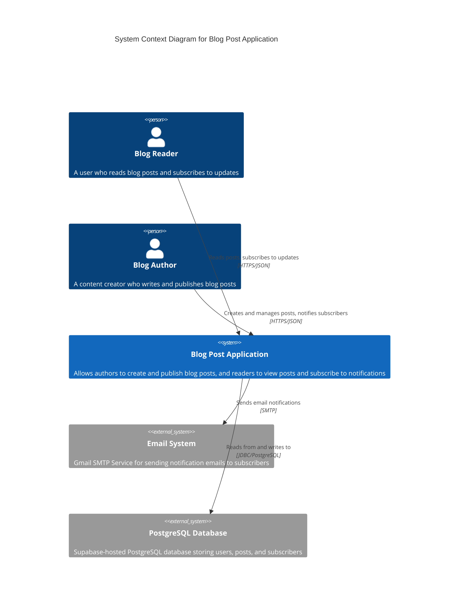
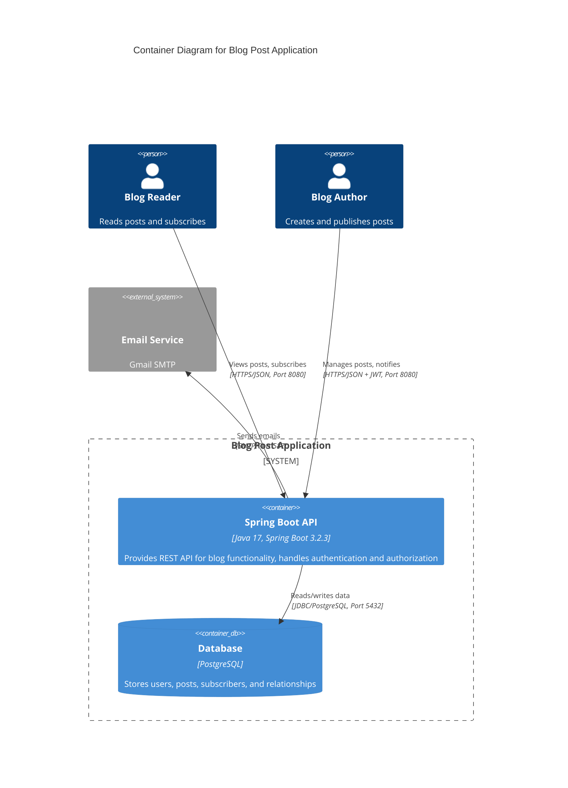
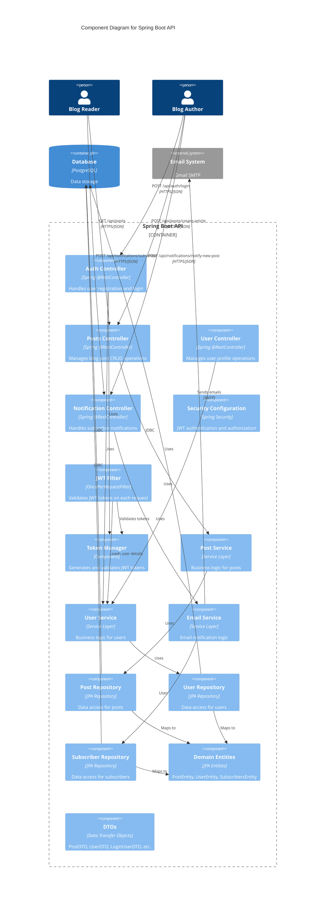
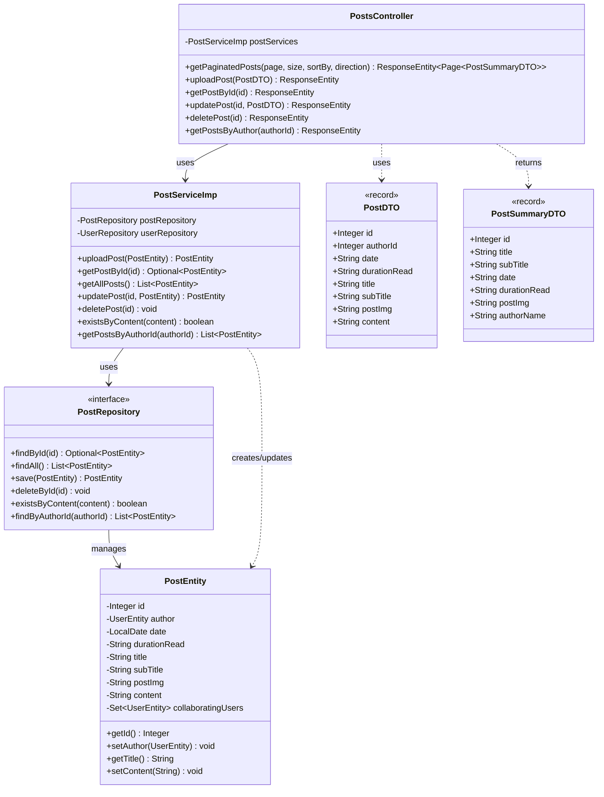
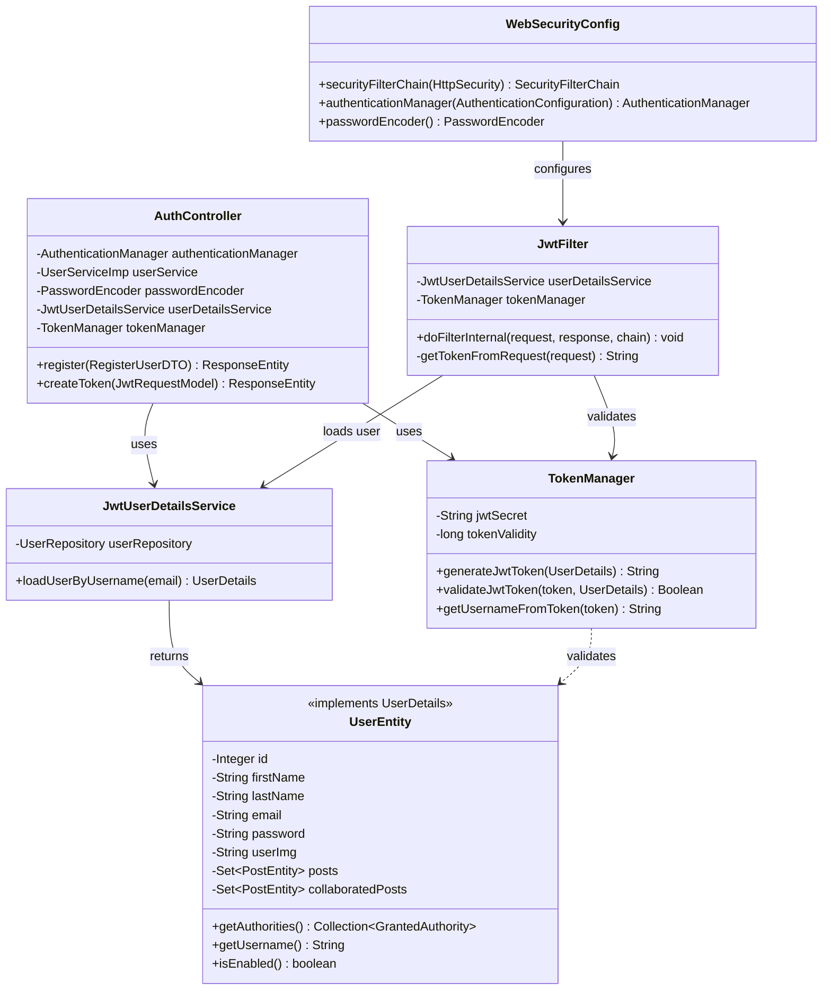
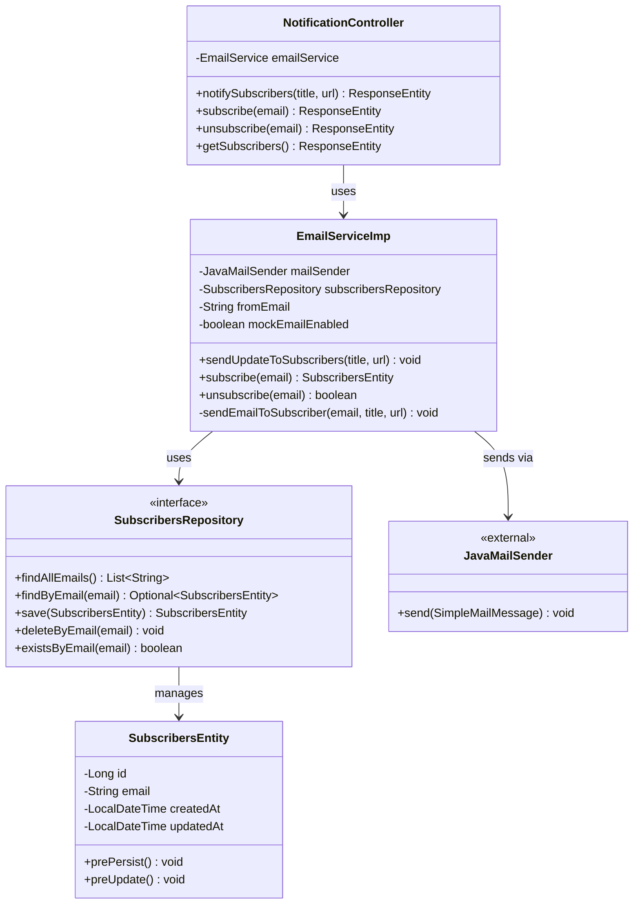
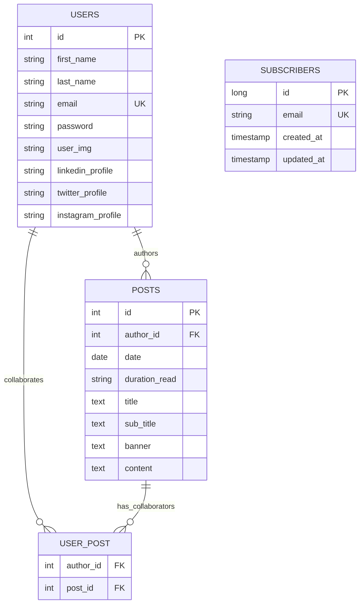
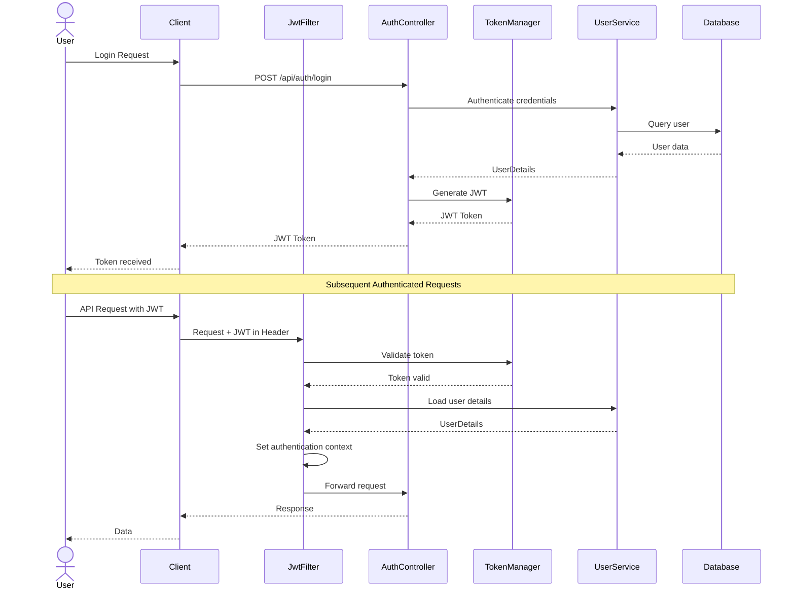
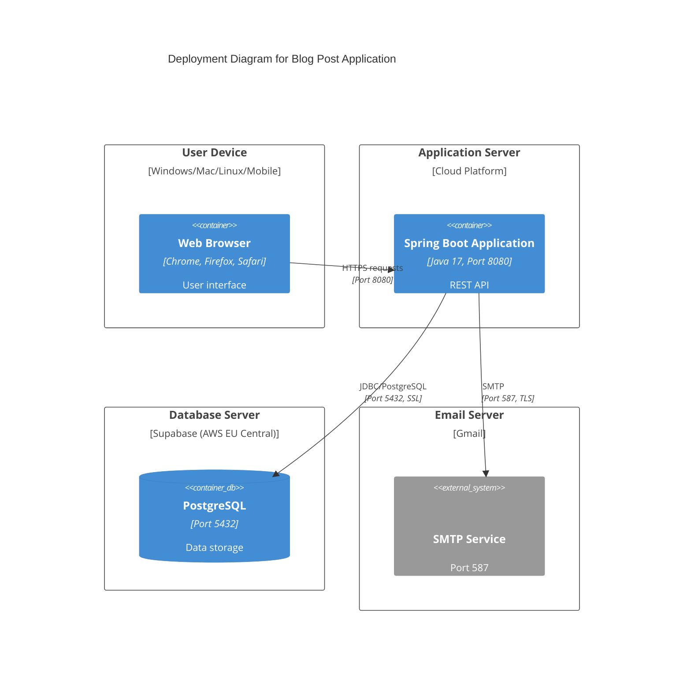

# C4 Model Architecture Documentation - Blog Post Application

This document provides a comprehensive architectural view of the Blog Post Application using the C4 Model with Mermaid diagrams.

## Table of Contents

1. [System Context Diagram (Level 1)](#level-1-system-context-diagram)
2. [Container Diagram (Level 2)](#level-2-container-diagram)
3. [Component Diagram (Level 3)](#level-3-component-diagram)
4. [Code Diagram (Level 4)](#level-4-code-diagram)

---

## Level 1: System Context Diagram

The System Context diagram shows the big picture - how the Blog Post Application fits into the world around it.

**Key Elements:**

-   **Blog Reader**: End users who consume content and can subscribe to updates
-   **Blog Author**: Authenticated users with author privileges who create content
-   **Blog Post Application**: The core Spring Boot application
-   **Email System**: Gmail SMTP for subscriber notifications
-   **PostgreSQL Database**: Supabase-hosted database for data persistence

---

## Level 2: Container Diagram

The Container diagram zooms into the Blog Post Application and shows the high-level technical building blocks.

**Key Technologies:**

-   **Spring Boot 3.2.3** with Java 17
-   **PostgreSQL** on Supabase (AWS EU Central)
-   **JWT Authentication** for security
-   **Spring Security** for authorization
-   **Spring Mail** for email notifications

---

## Level 3: Component Diagram

The Component diagram shows the internal structure of the Spring Boot application container.

**Component Layers:**

1. **Controller Layer**:

    - `AuthController`: User authentication (register/login)
    - `PostsController`: Blog post management (CRUD, pagination)
    - `UserController`: User profile management
    - `NotificationController`: Subscriber and notification management

2. **Security Layer**:

    - `WebSecurityConfig`: Security configuration
    - `JwtFilter`: Request interception and token validation
    - `TokenManager`: JWT token generation and validation
    - `JwtUserDetailsService`: User authentication service

3. **Service Layer**:

    - `PostService`: Post business logic
    - `UserService`: User business logic
    - `EmailService`: Email notification logic

4. **Repository Layer**:

    - `PostRepository`: Post data access
    - `UserRepository`: User data access
    - `SubscribersRepository`: Subscriber data access

5. **Domain Layer**:
    - DTOs for data transfer
    - Entities for database mapping

---

## Level 4: Code Diagram

The Code diagram shows the internal structure of key components. Here we focus on the Post Management flow.

### Post Management Component Details

### Authentication and Security Flow

### Email Notification Flow

---

## API Endpoints Overview

### Authentication Endpoints

-   `POST /api/auth/register` - Register a new user
-   `POST /api/auth/login` - Authenticate and receive JWT token

### Post Management Endpoints

-   `GET /api/posts/paginated` - Get paginated posts
-   `GET /api/posts/{id}` - Get specific post by ID
-   `POST /api/posts/create-article` - Create new post (Author only)
-   `PUT /api/posts/{id}` - Update existing post (Author only)
-   `DELETE /api/posts/{id}` - Delete post (Author only)

### User Management Endpoints

-   `GET /api/users/{id}` - Get user profile by ID

### Notification Endpoints

-   `POST /api/notifications/subscribe` - Subscribe to email notifications
-   `POST /api/notifications/unsubscribe` - Unsubscribe from notifications
-   `POST /api/notifications/notify-new-post` - Notify subscribers (Author only)
-   `GET /api/notifications/subscribers` - Get all subscribers (Author only)

---

## Data Model

---

## Security Architecture

### JWT Authentication Flow

---

## Deployment Architecture

---

## Technology Stack

### Backend Framework

-   **Spring Boot 3.2.3**
-   **Java 17**

### Security

-   **Spring Security**
-   **JWT (JSON Web Tokens)** - io.jsonwebtoken v0.11.2
-   **BCrypt Password Encoder**

### Data Persistence

-   **Spring Data JPA**
-   **Hibernate ORM**
-   **PostgreSQL Driver**

### Email Service

-   **Spring Mail**
-   **JavaMailSender**

### Build Tool

-   **Maven**

### Additional Libraries

-   **Spring Boot DevTools** - Development utilities
-   **Spring Validation** - Input validation
-   **Spring HATEOAS** - REST API enhancement

---

## Key Architectural Patterns

### 1. Layered Architecture

The application follows a clear layered architecture:

-   **Controller Layer**: REST endpoints
-   **Service Layer**: Business logic
-   **Repository Layer**: Data access
-   **Entity Layer**: Domain models

### 2. Dependency Injection

All components use constructor-based dependency injection for better testability and immutability.

### 3. DTO Pattern

Data Transfer Objects separate internal domain models from API contracts.

### 4. Repository Pattern

JPA repositories provide abstraction over data access logic.

### 5. Filter Chain Pattern

JWT authentication uses Spring Security filter chain for request interception.

### 6. Builder Pattern

DTOs use Java records for immutable data transfer.

---

## Security Features

1. **JWT Authentication**: Stateless token-based authentication
2. **Role-Based Authorization**: `@PreAuthorize` annotations for author-only endpoints
3. **Password Encryption**: BCrypt hashing for secure password storage
4. **SSL/TLS**: Database connections use SSL, email uses TLS
5. **CORS Configuration**: Controlled cross-origin resource sharing
6. **Exception Handling**: Global exception handler for security errors

---

## Quality Attributes

### Scalability

-   Stateless architecture with JWT
-   Connection pooling (HikariCP)
-   Pagination support for large datasets

### Security

-   JWT-based authentication
-   Password encryption
-   SSL/TLS for all external connections
-   Input validation

### Maintainability

-   Clear separation of concerns
-   Consistent naming conventions
-   Comprehensive logging
-   Exception handling strategy

### Performance

-   Connection pooling (max 5 connections)
-   Lazy loading for entity relationships
-   Indexed database columns (email)
-   Efficient query patterns

---

## Future Considerations

### Potential Enhancements

1. **Caching Layer**: Redis for post caching
2. **API Gateway**: For microservices migration
3. **Message Queue**: For asynchronous email processing
4. **CDN Integration**: For image storage and delivery
5. **Monitoring**: Application performance monitoring (APM)
6. **API Documentation**: OpenAPI/Swagger integration

---

## Glossary

-   **C4 Model**: A hierarchical set of software architecture diagrams for different levels of detail
-   **JWT**: JSON Web Token, a compact token format for authentication
-   **DTO**: Data Transfer Object, objects used to transfer data between layers
-   **JPA**: Java Persistence API, specification for object-relational mapping
-   **SMTP**: Simple Mail Transfer Protocol, for sending emails
-   **SSL/TLS**: Secure Sockets Layer/Transport Layer Security, encryption protocols

---

_This documentation was generated on November 19, 2025_
_Application Version: 0.0.1-SNAPSHOT_
